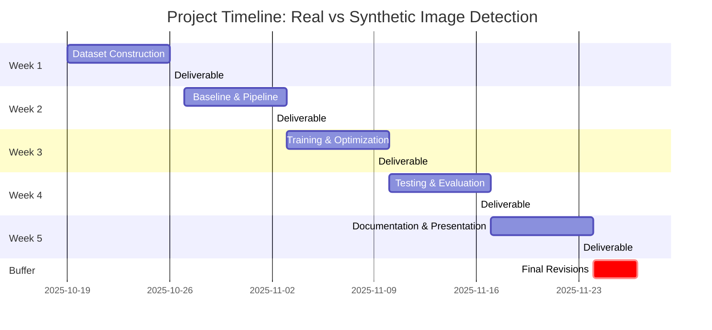

### Universal Fake Image Detection System
**SynthGuard: Universal Fake Image Detection System**

### Project Background introduction
The proliferation of AI-generated imagery poses an unprecedented challenge to information integrity. High-fidelity synthetic images now permeate digital ecosystems, with the most sophisticated examples evading human detection. This capability has enabled malicious actors to manipulate public discourse for strategic and financial gain. Consequently, robust and efficient methods for distinguishing AI-generated from authentic imagery have become critically necessary.

This study systematically evaluates existing detection approaches, identifies their limitations, and explores avenues for enhancement. We establish a comprehensive benchmark and propose incremental improvements to advance the state of detection capabilities.

### Team Information

| Member  | Student ID | Primary Responsibility |
|--------|---------------------|---------------------|
|----||----|
|----||----|
|XU, Zeling|21214680|----|
| ZHANG, Shengqi | | contribute to CNN solutions|

### Methodiligies

#### Convolutional Neural Networks (CNNs)

CNNs defenitely revolutionized the computer vision field since Their hierarchical feature extraction naturally aligns with image detection tasks by progressively learning from pixel-level patterns to high-level semantics, which is a natural fit for image detection tasks.

A well-performing CNN model can achieve hierarchical feature extraction while also being translation-invariant, making it highly sensitive to image microstructure. This allows it to effectively capture edges, texture, color distribution, local structure, and semantic information. Generated images, on the other hand, are prone to anomalies in details such as edges, lighting, color, and local texture; these differences can be used to distinguish generated images from real ones.

Also, CNN models have the benefits as below:

- **Efficiency**: Fast inference (10-15ms), low memory, deployable on edge devices
- **Reliability**: Proven track record, stable training, achieves 92-94% baseline accuracy
- **Simplicity**: Easy implementation, extensive pre-trained models, quick prototyping

#### Detection Model for Images Generated by Diffusion

The rise of diffusion models has spurred the development of specialized detection methods. Taking DIRE as an example, its core idea is to leverage a pre-trained diffusion model to perform "inversion-reconstruction" on input images and compute the reconstruction error. Research reveals that images generated by diffusion models can be well reconstructed with minimal error, while real images exhibit significantly larger reconstruction errors. However, this model requires large datasets and has slow inference speed. In contrast, the lightweight NPR approach starts from the generator architecture, focusing on the strong local pixel correlations introduced by upsampling operations in generated images - correlations absent in real images. NPR constructs feature maps based on neighboring pixel relationships and trains a CNN for classification. These detectors designed for diffusion models demonstrate excellent cross-model generalization capability in practice and remain robust to common image perturbations. Both models represent viable deployment solutions, and through parameter tuning and CNN structure fine-tuning, they may achieve enhanced generalization across diverse datasets.

#### Self Attention

The Vision Transformer (ViT), renowned for its powerful global modeling capability, has gained widespread recognition in AI-generated image detection due to its high accuracy and robustness. Various ViT variants—such as those trained on different datasets, DeiT (designed for small-sample scenarios), Swin Transformer, and CvT—are fundamentally built upon the original ViT architecture with structural modifications. Given the high cost and complexity of training from scratch, and considering the availability of well-established pretrained models, this study adopts the ViT-B/16 model pretrained on ImageNet-21k as the backbone network. Input images are resized to 224×224 RGB format, and the model leverages self-attention mechanisms to capture long-range dependencies across image patches. A single fully connected layer serves as the classification head, mapping the [CLS] token output to a binary classification space. During fine-tuning, the backbone is frozen while only the classification head is trained. Should performance prove insufficient, additional feature extraction layers may be introduced atop the backbone for further refinement.

#### Frequency Domain Analysis

While spatial-domain methods such as CNNs and Vision Transformers have demonstrated success in detecting AI-generated images, they face fundamental challenges when confronting the latest generation of sophisticated generative models. Recent research has revealed that traditional approaches often struggle against cutting-edge diffusion transformers, with detection accuracy sometimes dropping to near-random levels. This limitation has prompted exploration of alternative detection paradigms that can capture more persistent artifacts in synthetic imagery.

Frequency domain analysis emerges as a promising approach because it targets the fundamental mathematical signatures left by the generation process itself. Regardless of how photorealistic an AI-generated image appears, the architectural constraints of generative models inevitably introduce characteristic patterns in the frequency spectrum. These patterns arise from upsampling operations inherent to both GAN and diffusion-based generators, creating spectral fingerprints that persist even as visual quality improves.

### Project Timeline

**Week 1: Dataset Construction (Oct 19 - Oct 26)**

We will download the ImageNet-1K validation set and generate synthetic images using multiple state-of-the-art generative models. The collected data will be split into training, validation, and test sets to ensure proper evaluation. The deliverable for this week is a structured dataset with complete metadata.

**Week 2: Baseline & Data Pipeline (Oct 27 - Nov 2)**

We will implement a ResNet-50 baseline classifier and establish a robust data loading pipeline with standard augmentation techniques. Initial training experiments will be conducted to verify the pipeline functionality. The deliverable includes a working training pipeline and baseline performance results.

**Week 3: Model Training & Optimization (Nov 3 - Nov 9)**

This week focuses on hyperparameter tuning and training the model on the full dataset. We will validate the model performance to ensure it meets the target accuracy threshold. The deliverable is a trained model checkpoint ready for comprehensive evaluation.

**Week 4: Robustness & Generalization Testing (Nov 10 - Nov 16)**

We will evaluate the trained model on the held-out test set and assess its generalization capability on images from unseen generators. Robustness tests will be conducted under various perturbations, and interpretability analysis will be performed to understand model decision-making. The deliverable is a comprehensive evaluation report.

**Week 5: Documentation & Presentation (Nov 17 - Nov 23)**

The final week is dedicated to writing the technical report and preparing the presentation materials. We will also complete code documentation and repository cleanup to ensure reproducibility. The deliverables include the final report, presentation slides, and a well-documented code repository.

